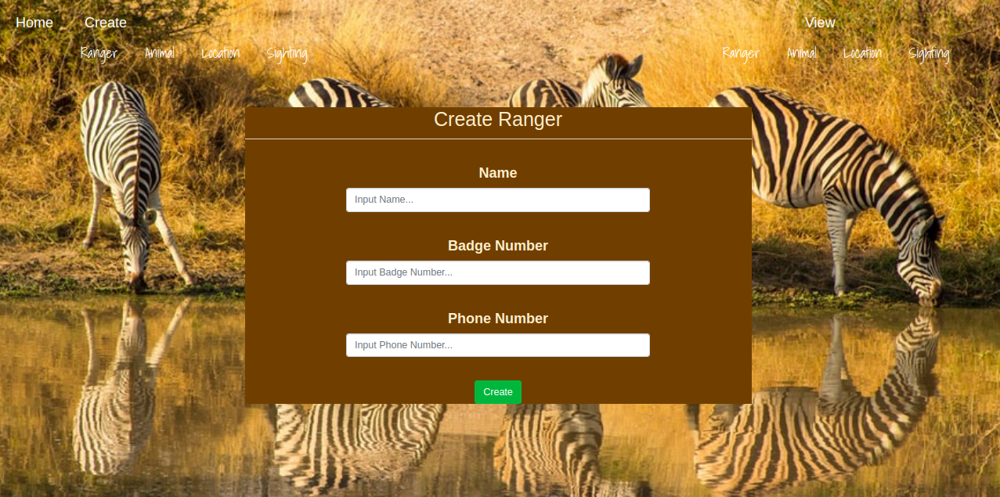

# WILDLIFE-TRACKER
### DESCRIPTION
Wildlife Tracker is an app that allows one to record sightings of various animal,It allows one to create rangers,locations,animals and sightings. It also allows you to view rangers locations sightings and animals. One can also view sightings a ranger has made and locations with the sightings that have occured in them.
### Author
[UWITONZE BRENDAH](https://github.com/brendahuwitonze)
### IMAGE OF THE PROJECT

[Link to the project](/home/brendah/Downloads/new_wildlife/src/main/resources/public/images/pro.png)

[wildlife_tracker](  https://wildlifebrendah.herokuapp.com/)

## setup of the database
In PSQL:
* CREATE DATABASE wildlife_tracker;
\c wildlife_tracker

* CREATE TABLE animals (id serial PRIMARY KEY, name varchar,type VARCHAR,health VARCHAR,age VARCHAR);

* CREATE TABLE locations (id serial PRIMARY KEY,name VARCHAR);

* CREATE TABLE locations_sightings (id serial PRIMARY KEY,location_id INT,sighting_id INT);
* CREATE TABLE Endengered(name VARCHAR,health VARCHAR)

* CREATE TABLE rangers (id serial PRIMARY KEY,name VARCHAR,badge_number VARCHAR,phone-number INT );
CREATE TABLE rangers_sightings (id serial PRIMARY KEY,ranger_id INT,sighting_id INT);
* CREATE TABLE sightings (id serial PRIMARY KEY,animal_id INT,ranger_id INT,location_id INT,time TIMESTAMP);
CREATE DATABASE wildlife_tracker_test WITH TEMPLATE wildlife_tracker;

#### To run the database locally
* Go to DB.class in main/java folder and make necessary changes
* Go to DatabaseRule in test/java folder and make necessary changes

### TECHNOLOGIES USED
* JAVA
* Heroku
* CSS
* HBS

## LICENSE
This project is licensed under the terms of the MIT license. Copyright (c) 2020 UWITONZEBRENDA

Permission is hereby granted, free of charge, to any person obtaining a copy of this software and associated documentation files (the "Software"), to deal in the Software without restriction, including without limitation the rights to use, copy, modify, merge, publish, distribute, sublicense, and/or sell copies of the Software, and to permit persons to whom the Software is furnished to do so, subject to the following conditions:

